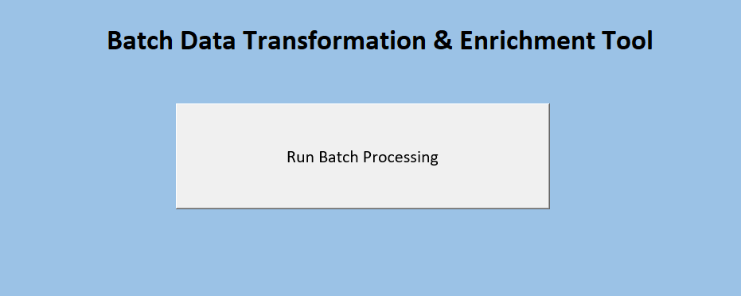
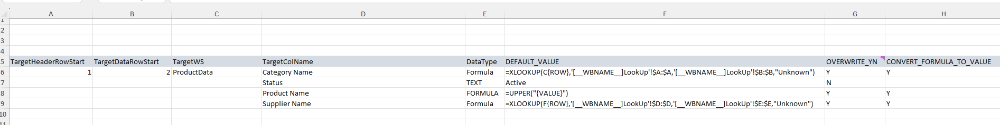
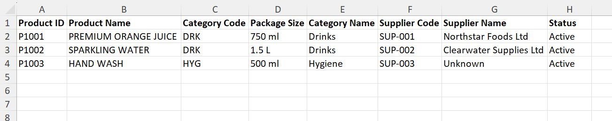

# Excel VBA Batch Data Transformation & Enrichment Tool

A configuration-driven Excel VBA automation tool for processing, transforming and enriching multiple Excel workbooks in a batch.

The tool was originally developed to replace a highly manual data-preparation process involving **300+ Excel workbooks**. Rather than opening, updating, validating and saving each workbook individually, the solution allows transformation rules to be configured centrally and then applied automatically across a folder of Excel files.

This repository contains a fully sanitised portfolio version using fictional product and supplier data.

---

## Project Overview

Large-scale Excel-based data preparation can become extremely repetitive when the same transformations need to be performed across hundreds of workbooks.

This solution provides a reusable VBA processing engine where transformation rules are maintained on a **Control** sheet rather than hard-coded into the VBA.

The user selects a folder containing Excel workbooks and the tool:

1. Identifies the Excel files in the selected folder.
2. Opens each workbook in sequence.
3. Locates the configured target worksheet.
4. Applies the transformation and enrichment rules defined on the Control sheet.
5. Performs formula-based transformations and lookups.
6. Optionally converts formulas to values.
7. Creates an amended copy of the processed workbook.
8. Leaves the original source workbook unchanged.
9. Allows the user to continue to the next workbook in the batch.

This separates the **processing engine** from the **business transformation rules**, making the tool much easier to reuse for different datasets.

---

## Key Features

- Batch processing of multiple Excel workbooks
- Folder-based file selection
- Configuration-driven transformation rules
- Dynamic target-column detection using column headers
- Static default-value population
- Excel formula-based transformations
- Lookup-based data enrichment
- Transformation of existing populated columns
- Population of previously blank columns
- Multiple overwrite behaviours
- Optional formula-to-value conversion
- Dynamic workbook references
- Automatic creation of amended output files
- Timestamped output filenames
- Original source workbooks remain unchanged
- User-controlled continuation between files
- Generic VBA engine with transformation logic held in Excel formulas

---

## Screenshots

### Front Page

The workbook provides a simple interface for launching the batch process.



### Configuration-Driven Rules

Transformation and enrichment rules are maintained centrally on the Control sheet.



### Amended Output

The processing engine applies the configured rules and creates an amended version of each source workbook.



---

## Configuration-Driven Design

A key design principle of this project is that individual transformation rules are **not hard-coded into the VBA processing engine**.

Instead, the Control sheet defines what should happen to each target column.

Example configuration:

| Target Column | Data Type | Default / Formula | Overwrite |
|---|---|---|---|
| Category Name | FORMULA | XLOOKUP using Category Code | Y |
| Status | TEXT | Active | N |
| Product Name | FORMULA | Convert existing value to uppercase | Y |
| Supplier Name | FORMULA | XLOOKUP using Supplier Code | Y |

This allows the same VBA engine to perform different transformations simply by changing the configuration.

---

## Dynamic Formula Templates

The tool supports standard **A1-style Excel formulas** together with reusable placeholders.

### `{ROW}`

Represents the current target row.

Example:

```excel
=XLOOKUP(C{ROW},'[__WBNAME__]LookUp'!$A:$A,'[__WBNAME__]LookUp'!$B:$B,"Unknown")
```

When processing row 2, `{ROW}` becomes `2`.

When processing row 3, it becomes `3`, and so on.

This allows normal Excel formulas to be configured without requiring R1C1 formula notation.

---

### `{VALUE}`

Represents the existing value in the target cell.

Example:

```excel
=UPPER("{VALUE}")
```

If the existing Product Name is:

```text
Premium Orange Juice
```

the formula is dynamically generated using that value and the final result becomes:

```text
PREMIUM ORANGE JUICE
```

This allows formulas to transform **existing populated columns**, not just populate blank columns.

---

### `__WBNAME__`

Represents the name of the macro workbook at runtime.

This is useful when formulas need to reference lookup tables stored inside the automation workbook.

Example:

```excel
=XLOOKUP(F{ROW},'[__WBNAME__]LookUp'!$D:$D,'[__WBNAME__]LookUp'!$E:$E,"Unknown")
```

The VBA replaces `__WBNAME__` in memory with the actual workbook name when the formula is executed.

The Control sheet itself therefore remains reusable and does not need to contain a hard-coded workbook filename.

---

## Overwrite Modes

The processing engine supports several overwrite behaviours through `OVERWRITE_YN`.

| Mode | Behaviour |
|---|---|
| `Y` | Populate/overwrite all applicable rows |
| `N` | Populate blank cells only |
| `E` | Populate existing cells only |
| `C` | Capture the value from the first data row and copy it down |

These modes allow different rules to be applied without changing the VBA code.

For example, a default Status of `Active` can use mode `N`, ensuring existing statuses are preserved while blank statuses are populated.

---

## Formula-to-Value Conversion

Formula-driven transformations can optionally be converted to values after processing.

This is controlled through:

```text
CONVERT_FORMULA_TO_VALUE
```

When enabled, the tool:

1. Generates and evaluates the configured Excel formulas.
2. Captures the calculated results.
3. Replaces the formulas with their resulting values.

This produces clean amended workbooks that do not need to retain the transformation formulas.

---

## Lookup-Based Enrichment

The portfolio demonstration includes two fictional lookup examples.

### Category Enrichment

A Category Code such as:

```text
DRK
```

is enriched to:

```text
Drinks
```

using an XLOOKUP against the workbook's `LookUp` sheet.

### Supplier Enrichment

A Supplier Code such as:

```text
SUP-001
```

is enriched to:

```text
Northstar Foods Ltd
```

The lookup logic itself remains in the Control configuration rather than being embedded into bespoke VBA procedures.

---

## Batch Processing Workflow

The typical workflow is:

```text
Configure Rules
      ↓
Select Folder
      ↓
Open Workbook
      ↓
Locate Target Worksheet
      ↓
Apply Configured Rules
      ↓
Perform Transformations / Lookups
      ↓
Convert Formulas to Values (if enabled)
      ↓
Save Amended Copy
      ↓
Original Workbook Remains Unchanged
      ↓
Continue to Next Workbook
```

This architecture was designed for situations where the same preparation logic needs to be applied repeatedly across large numbers of Excel files.

---

## Source File Protection

The tool is designed so that the original source workbook is not overwritten.

Processed files are written to an:

```text
Amended
```

folder.

Output filenames include a timestamp and amended-file indicator, allowing processed versions to be distinguished from their source files.

This behaviour was specifically tested using multiple fictional demonstration workbooks.

---

## Demonstration Data

The `Demo_Files` folder contains fictional workbooks that can be used to demonstrate the batch-processing functionality.

Example fields include:

- Product ID
- Product Name
- Category Code
- Package Size
- Category Name
- Supplier Code
- Supplier Name
- Status

All demonstration records, company names, supplier names and codes in this repository are fictional and are provided solely to demonstrate the technical functionality of the VBA solution.

---

## Tested Scenarios

The portfolio version has been tested for:

- Single-workbook processing
- Multiple-workbook batch processing
- Dynamic row-based formulas
- Lookup formulas
- Population of blank target columns
- Transformation of existing populated columns
- `{ROW}` substitution
- `{VALUE}` substitution
- Dynamic `__WBNAME__` substitution
- `Y` overwrite mode
- `N` blank-only mode
- `E` existing-only mode
- `C` copy-down mode
- Formula-to-value conversion
- Multiple enrichment rules in the same run
- Creation of separate amended outputs
- Preservation of the original source workbooks

A two-workbook batch test successfully produced two independent amended output files from a single processing run.

---

## Repository Structure

```text
Excel-VBA-Batch-Data-Transformation-Tool/
│
├── Batch_Data_Enrichment_Portfolio.xlsm
│
├── README.md
│
├── Demo_Files/
│   ├── Demo_Product_Data_01.xlsx
│   ├── Demo_Product_Data_02.xlsx
│   └── README.md
│
├── VBA/
│   ├── POPULATE.bas
│   └── README.md
│
└── Screenshots/
    ├── 01_FrontPage.png
    ├── 02_Control_Configuration.png
    ├── 03_Amended_Output.png
    └── README.md
```

---

## VBA Architecture

The VBA module acts as the generic processing engine.

Key responsibilities include:

- Selecting the source folder
- Discovering Excel workbooks
- Opening each workbook
- Reading configuration from the Control sheet
- Locating columns dynamically from their headers
- Applying population and transformation rules
- Substituting formula placeholders
- Applying overwrite modes
- Converting formula results to values
- Saving amended copies
- Closing processed workbooks
- Controlling progression through the batch

The transformation logic remains primarily configuration-driven rather than being embedded as individual business-specific VBA routines.

The exported VBA source is available in:

```text
VBA/POPULATE.bas
```

This allows the code to be reviewed directly on GitHub without downloading the macro-enabled workbook.

---

## Technologies Used

- Microsoft Excel
- Excel VBA
- Excel formulas
- XLOOKUP
- File-system automation
- Dynamic column/header mapping
- Configuration-driven processing
- Batch workbook automation
- Data transformation
- Data enrichment

---

## Why I Built This

The original solution was created to address a real-world data-preparation requirement involving **more than 300 Excel workbooks**.

Processing these files manually required repetitive workbook-by-workbook activity.

The objective was to move that repeatable work into a controlled automation process where:

- rules could be configured centrally;
- multiple files could be processed consistently;
- Excel formulas could define transformations;
- lookup data could be maintained separately;
- outputs could be generated without altering the originals; and
- the processing engine could be reused rather than rewritten for every transformation.

The portfolio version retains that architecture while replacing the original business data and configuration with completely fictional demonstration data.

---

## Portfolio Context

This project demonstrates practical experience in:

- Excel VBA automation
- Advanced Excel
- Data transformation
- Data cleansing and enrichment
- Batch processing
- Configuration-driven development
- Reusable automation design
- Formula automation
- Data quality preparation
- Operational process improvement

It is representative of the type of Excel/VBA automation I have developed in enterprise data environments.

---

## Disclaimer

This repository is a **sanitised portfolio demonstration**.

The demonstration data is fictional and does not contain confidential, proprietary or client information. The portfolio version has been adapted specifically to demonstrate the technical design and automation approach.

---

## Author

**Hasnaad Din**  
Senior Data Analyst & Excel VBA Automation Engineer

Specialising in:

**Excel VBA | SQL | Data Migration | ETL | Python | Advanced Excel | Data Analysis**

LinkedIn: [linkedin.com/in/hasnaaddin](https://www.linkedin.com/in/hasnaaddin)

Portfolio: [hasnaaddin.github.io](https://hasnaaddin.github.io/)
